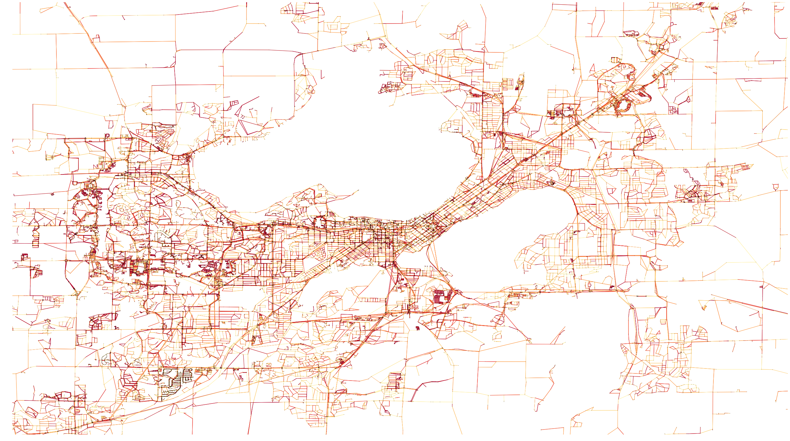
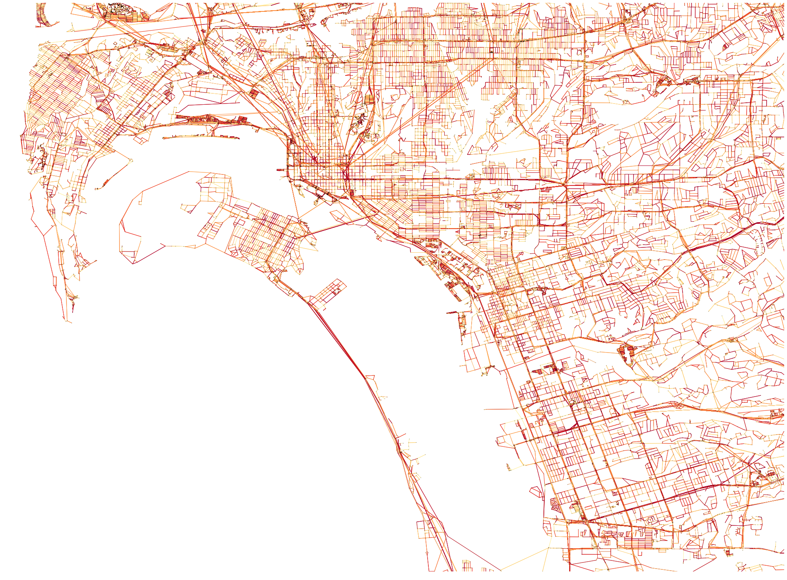

.. _gallery-section:

Network Gallery
=====================

Here are some examples of GTFS and OSM networks that have been created using UrbanAccess:

**Oakland, CA**
|oakland|
*Integrated AC Transit and BART transit and pedestrian network travel times for Oakland, CA*

**Madison, WI**
|madison|
*Integrated Metro Transit and pedestrian network travel times for Madison, WI*

**San Diego, CA**
|sandiego|
*Integrated MTS and NCTD transit and pedestrian network travel times for San Diego, CA*

**Scotland, Wales and England rail network**
|uk_rail|
*Rail network for Scotland, Wales and England*

If you have interesting examples and would like us to share them here please contact us.

.. |oakland| image:: _images/travel_time_net.png
	:scale: 80%

.. |uk_rail| image:: _images/uk_rail.png
	:scale: 80%